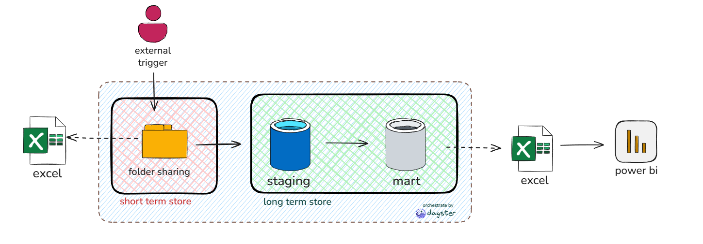
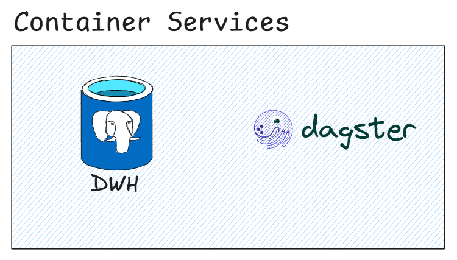
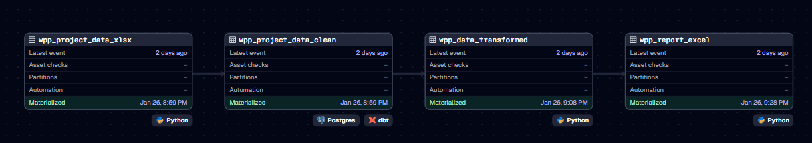

# Sample case Data-Ingestion
This project simulates a data ingestion from external source using docker compose. It establishes an orchestration layer with Dagster and data storages (DWH) using PostgreSQL.



Simulation:
1. User attach a data to folder sharing.
1. Then a background job will catch on to move the data torwards data staging in database.
1. Once completed, the data will be cleaned and transformed according to business needs and store it on the data mart layer.
1. The final result wil be ready to be consumed by next user. In this case the output is excel that will be stored in PowerBI.



I build the container using docker compose that contains:
### 1. DWH/Analytical Storage
   **Function:** Serves as the central Data Warehouse (and Dagster storage backend).
### 2. Dagster
**Function:** Manages data pipelines, scheduling, and monitoring.
   * **Components:** 
      *   `webserver`: The UI for managing runs and assets (Port `3000`).
      *   `daemon`: Handles scheduling and sensors.
      *   `worker`: Executes the actual data pipeline code and resource management.

## Pipeline Implementation


### 1. wpp_project_data_xlsx
- This asset consume data from folder sharing and load it into schema 'raw' in the DWH.
### 2. wpp_project_data_clean
- This asset cleaning data such as remove duplicate, fill NaN data, and change data type using dbt.
- This asset stored in 'mart' schema inside the DWH.
### 3. wpp_project_data_transfromed
- This asset transforms the cleaned data using logarithmic functions
### 4. wpp_report_excel
- This asset export the data transformed into excel output

## Quick Start
### Run the Project
Start the services in detached mode:
```bash
docker-compose up -d --build
```

### https://github.com/cheryylam/data-ingestion-test
  
